# 🔥 PhoenixSIEM — AI-Powered Security Intelligence Platform


**PhoenixSIEM** is an enterprise-grade Security Information & Event Management (SIEM) dashboard concept — built as a fully interactive frontend demo with AI-powered threat analysis, real-time event monitoring, MITRE ATT&CK mapping, and SOC operations workflows, all wrapped in a striking **HDR 3D dark theme**.

🔗 **Live Demo:** [dedsechack-1337.github.io/PhoenixSIEM](https://dedsechack-1337.github.io/PhoenixSIEM/)

---

## 📸 Screenshots

### 🔐 Login — Secure SOC Authentication
Animated mouse-reactive circuit background, glowing Phoenix branding, and quick demo-account login.

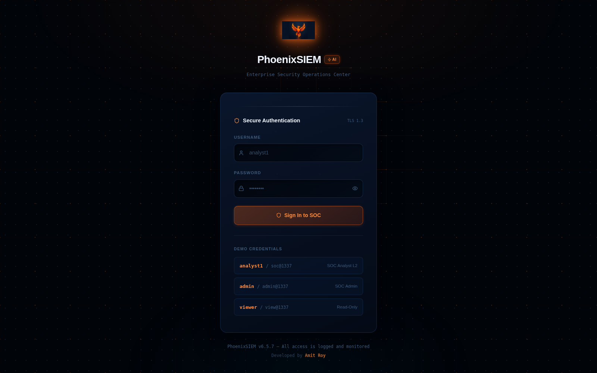

---

### 📊 Dashboard — Security Overview
Real-time stat cards, event timeline chart, severity distribution, recent events, and active alerts — all at a glance.

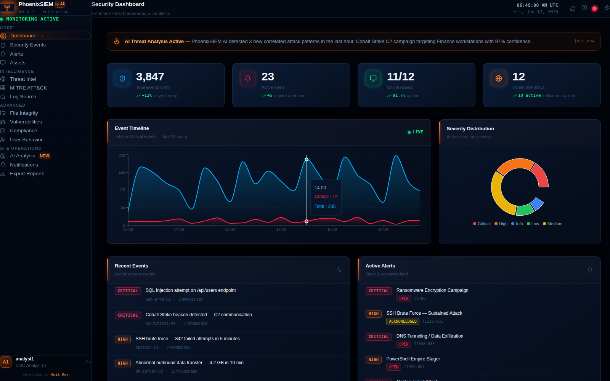

---

### 🛡️ Security Events
Live feed of 40+ monitored event types with severity tagging, host info, and timestamps.

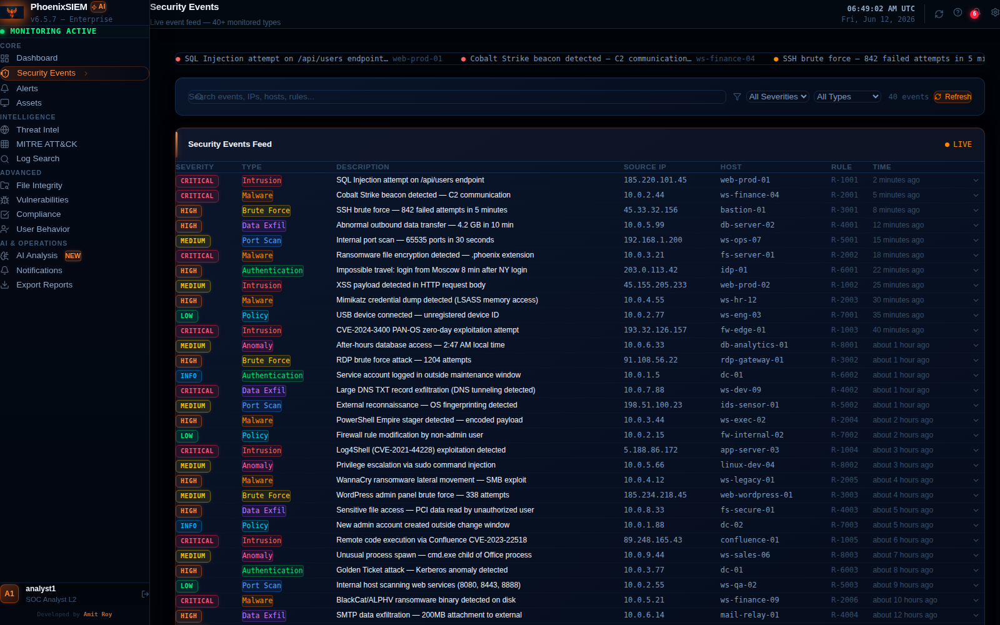

---

### 🔔 Alert Management
Correlated alerts mapped to MITRE ATT&CK techniques, with status tracking (Open / Acknowledged / Investigating / Resolved / Closed) and investigation notes.

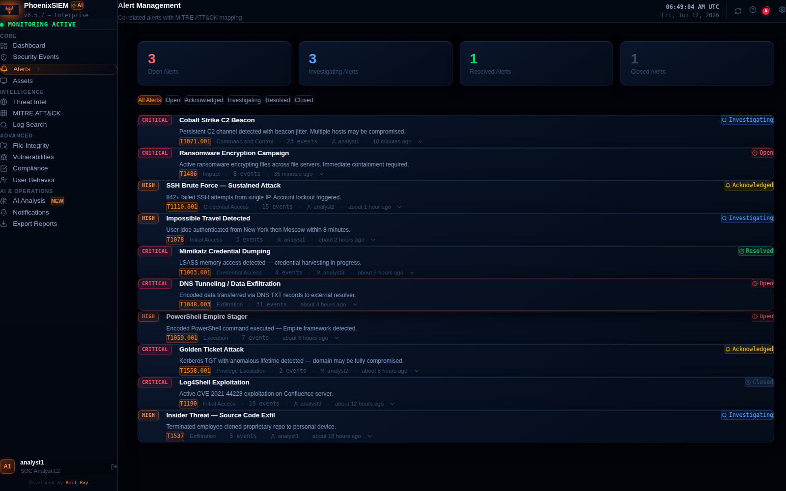

---

### 🖥️ Asset Inventory
Full endpoint and network device inventory with risk scores, OS info, owners, and tags.

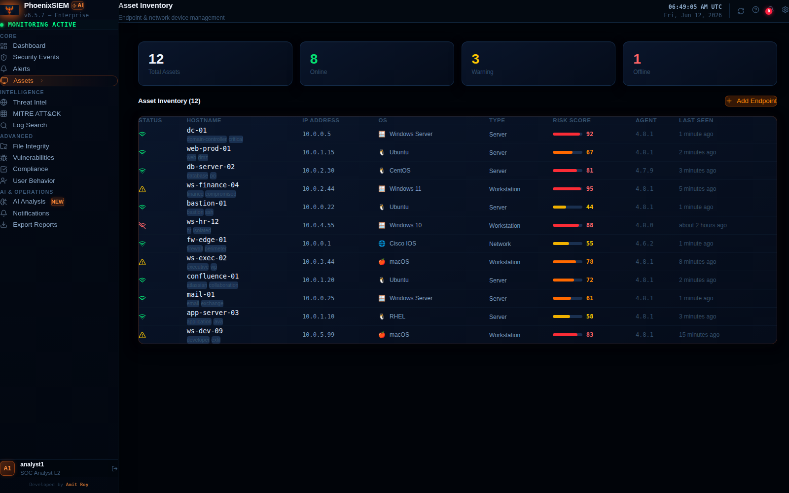

---

### 🌐 Threat Intelligence
IOC (Indicator of Compromise) database with confidence scoring, categories, and active threat feeds.

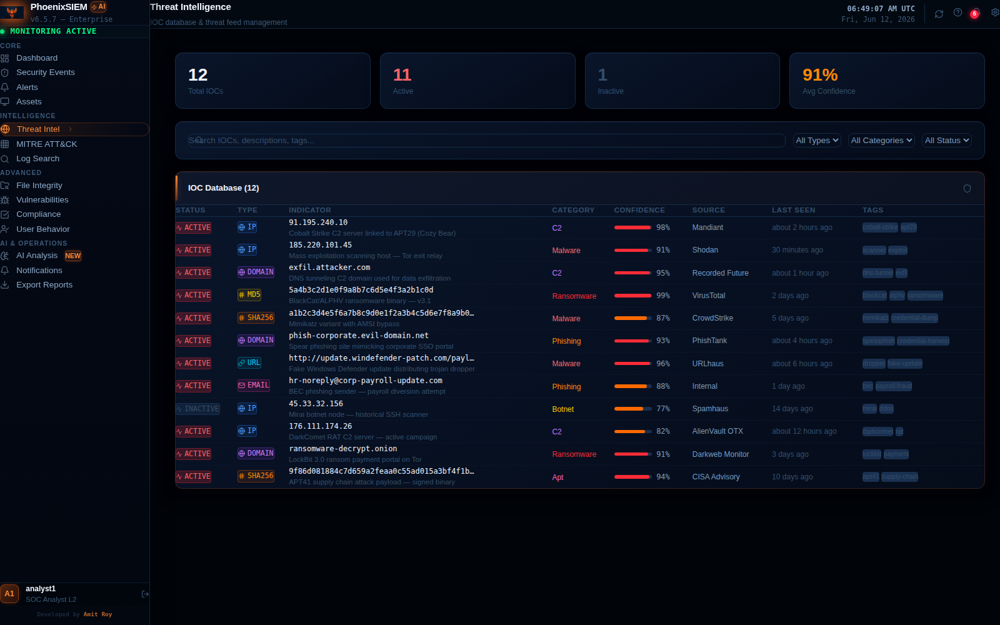

---

### 🎯 MITRE ATT&CK Heatmap
Visual technique-coverage map showing detection strength across the ATT&CK framework.

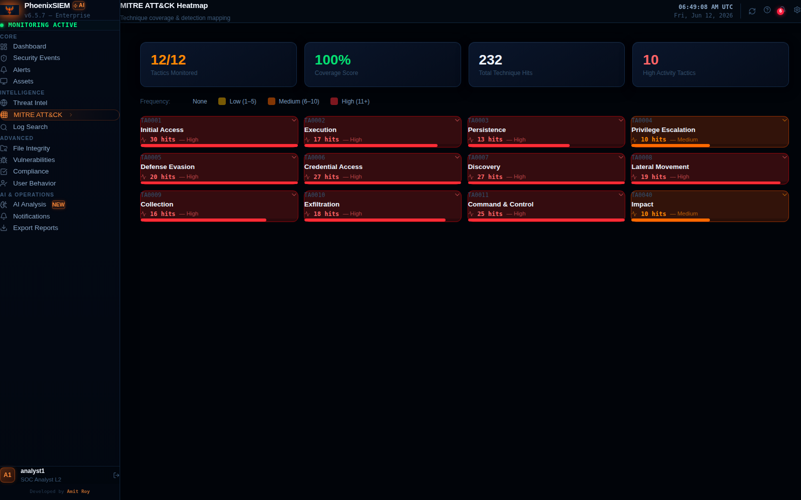

---

### 🔍 Log Search
Raw log investigation and forensic search across all ingested data sources.

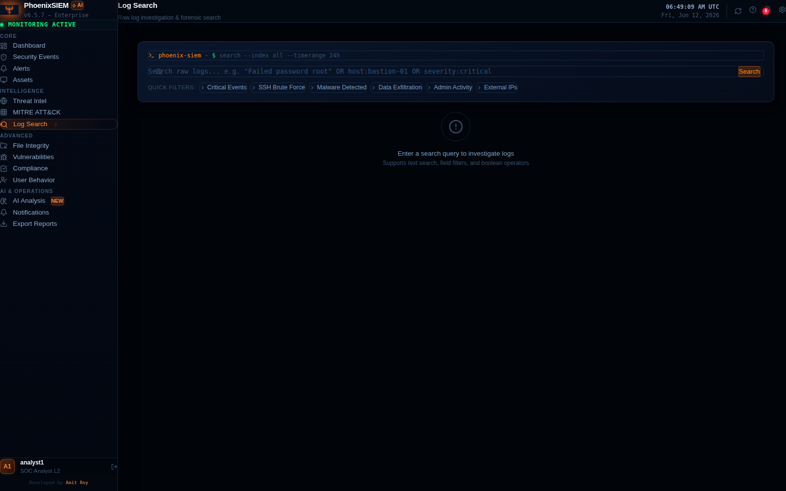

---

### 📁 File Integrity Monitoring (FIM)
Real-time file change detection and alerting for critical system paths.

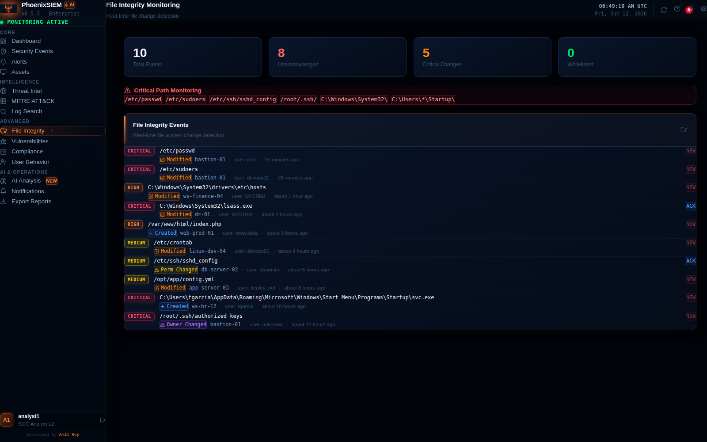

---

### 🐛 Vulnerability Management
CVE tracking with CVSS scoring and patch management status across the fleet.

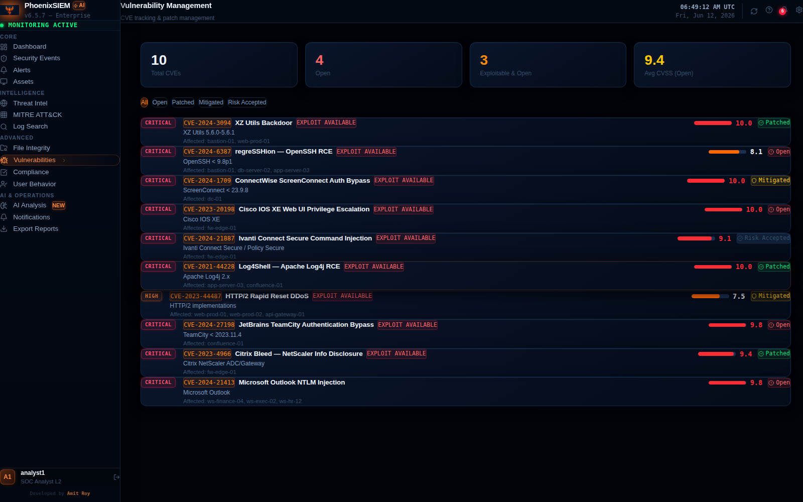

---

### ✅ Compliance Center
Track compliance posture against PCI-DSS, HIPAA, NIST, SOC 2, and ISO 27001 frameworks.

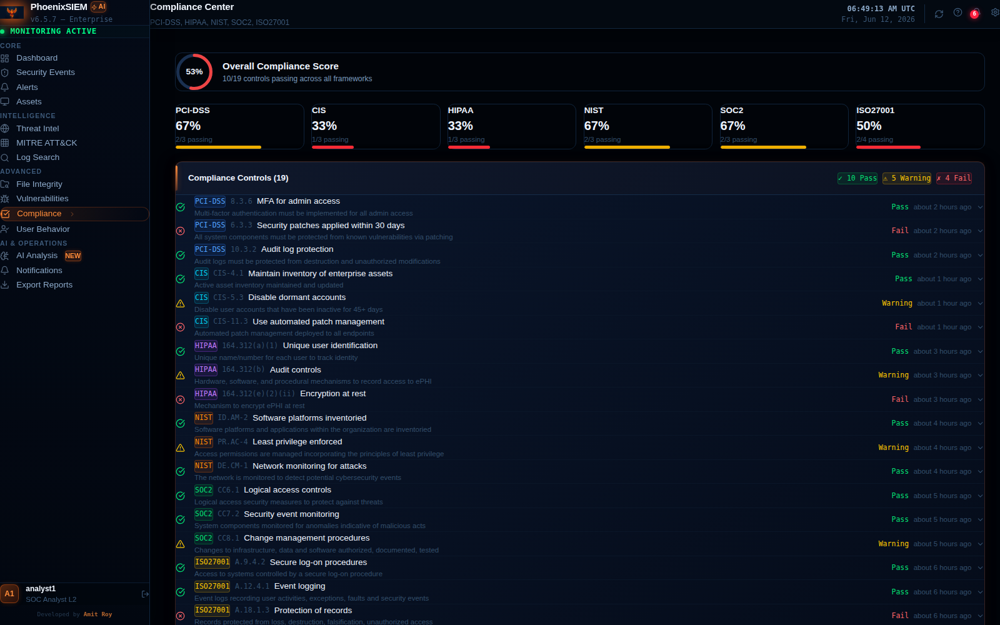

---

### 👤 User Behavior Analytics (UBA)
AI-driven anomaly detection for insider threats and abnormal user activity patterns.

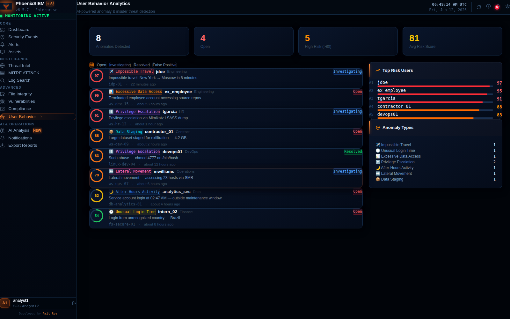

---

### 🤖 Phoenix AI — Threat Analysis
Claude-powered AI analyst chat with **live SIEM context** automatically injected — ask about active threats, get MITRE mappings, incident response plans, and executive summaries.

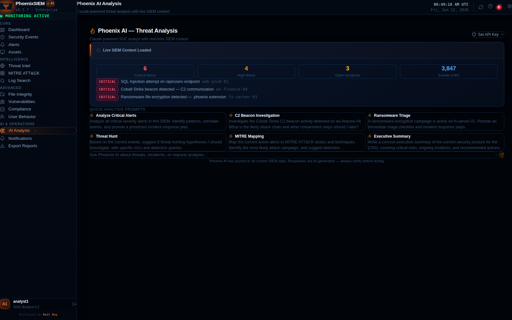

---

### 📣 Alert Notifications
Configure Email & Slack webhook channels with per-severity filtering, test sends, and delivery logs.

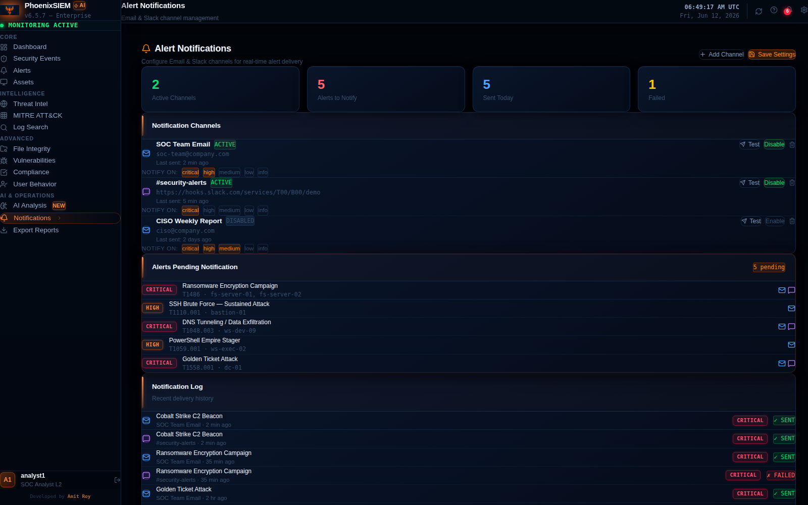

---

### 📥 Export Reports
Download Alerts, Events, Assets, and Threat Intel as **CSV**, or generate a polished **Executive Summary HTML report**.

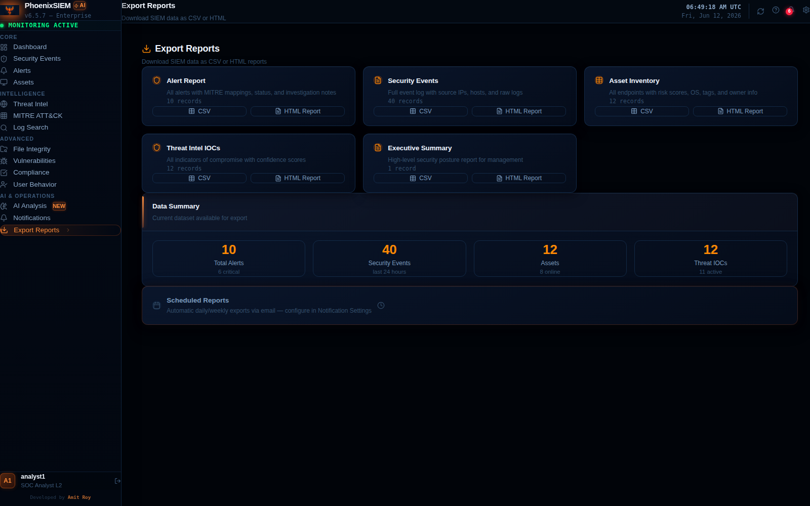

---

## ✨ Features

| Category | Features |
|---|---|
| **Authentication** | Login page with 3 role-based demo accounts (Analyst, Admin, Viewer), session persistence, protected routes |
| **Dashboard** | Live stat cards, event timeline charts, severity donut chart, recent events & alerts feed |
| **Alerts** | Status workflow (Open → Acknowledged → Investigating → Resolved → Closed), MITRE mapping, notes |
| **AI Analysis** | Claude API chat assistant with live SIEM data context, 6 quick-prompt templates |
| **Notifications** | Email + Slack channel management, severity filters, test delivery, notification log |
| **Export** | CSV exports for all data types + HTML executive report generation |
| **Theme** | HDR 3D dark theme — glowing severity badges, animated tech background, depth-layered cards |

---

## 🚀 Getting Started

### Prerequisites
- [Node.js](https://nodejs.org/) v18 or higher
- npm (comes with Node.js)

### Installation

```bash
# Clone the repository
git clone https://github.com/dedsechack-1337/PhoenixSIEM.git
cd PhoenixSIEM

# Install dependencies
npm install
```

### Run in development mode

```bash
npm run dev
```
Open the URL shown in the terminal (usually `http://localhost:5173`).

### Build for production

```bash
npm run build
```
This generates the `dist/` folder, which is what GitHub Pages serves.

### Preview the production build locally

```bash
npm run preview
```

---

## 🔑 Logging In

When you open the app, you'll land on the **Login** page. Use any of the built-in demo accounts:

| Username | Password | Role |
|---|---|---|
| `analyst1` | `soc@1337` | SOC Analyst L2 |
| `admin` | `admin@1337` | SOC Administrator |
| `viewer` | `view@1337` | Read-Only Analyst |

💡 **Tip:** Click any of the demo credential rows on the login screen to auto-fill the form.

---

## 🧭 Navigating the Platform

The left **sidebar** is grouped into 4 sections:

### Core
- **Dashboard** — overview of system health, events, and alerts
- **Security Events** — full live event feed
- **Alerts** — manage and investigate active alerts
- **Assets** — view and manage your endpoint inventory

### Intelligence
- **Threat Intel** — browse tracked IOCs and threat feeds
- **MITRE ATT&CK** — see technique coverage heatmap
- **Log Search** — search raw logs for forensic investigation

### Advanced
- **File Integrity** — monitor critical file changes
- **Vulnerabilities** — track CVEs and patch status
- **Compliance** — view framework compliance scores
- **User Behavior** — review anomalous user activity

### AI & Operations
- **AI Analysis** — chat with Phoenix AI about your security data
- **Notifications** — set up Email/Slack alert channels
- **Export Reports** — download CSV/HTML reports

---

## 🤖 Using AI Analysis

1. Go to **AI Analysis** in the sidebar.
2. Click **"Set API Key"** and paste your [Anthropic API key](https://console.anthropic.com/) (stored only in your browser session — never sent anywhere except Anthropic's API).
3. Use one of the **quick prompts** (e.g. "Analyze Critical Alerts", "C2 Beacon Investigation") or type your own question.
4. Phoenix AI automatically receives a snapshot of your current alerts, events, and asset data as context, so its answers reference real platform data.

> ⚠️ AI responses are generated content — always verify recommendations before taking action in a real environment.

---

## 📣 Setting Up Notifications

1. Go to **Notifications**.
2. Click **"Add Channel"**, choose **Email** or **Slack Webhook**, give it a name and destination, and select which severities should trigger it.
3. Use the **Test** button on any channel to simulate a delivery.
4. The **Notification Log** at the bottom shows delivery history.

---

## 📥 Exporting Data

1. Go to **Export Reports**.
2. Pick a dataset (Alerts, Events, Assets, Threat Intel, or Executive Summary).
3. Click **CSV** to download a spreadsheet-ready file, or **HTML Report** for a formatted, printable summary (open it in a browser and use *Print → Save as PDF* if you need a PDF).

---

## 🛠️ Tech Stack

- **React 18** + **TypeScript**
- **Vite** — build tooling
- **Tailwind CSS v4** — utility styling
- **Recharts** — data visualizations
- **React Router (HashRouter)** — client-side routing (GitHub Pages compatible)
- **Lucide React** — icon set
- **date-fns** — date formatting
- **Anthropic Claude API** — AI threat analysis

---

## 📦 Deploying to GitHub Pages

```bash
npm run build
git add dist/
git commit -m "build: update dist"
git push
```

Make sure GitHub Pages is configured to serve from the `dist/` folder (or the branch/folder you've set in repo Settings → Pages), and that `vite.config.ts` has the correct `base: '/PhoenixSIEM/'` path.

---

## 👨‍💻 Credits

**Developed by [Amit Roy](https://github.com/dedsechack-1337)**

Built with ❤️ using React, Vite, and the Claude API.

---

## 📄 License

This project is provided as-is for demonstration and educational purposes.
